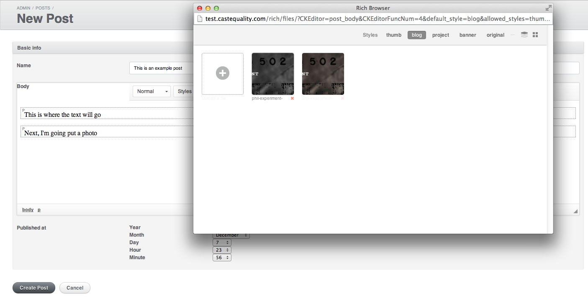
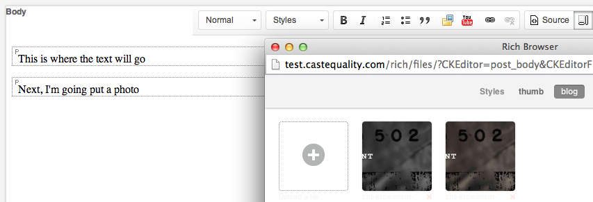
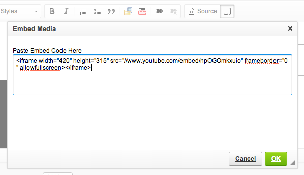
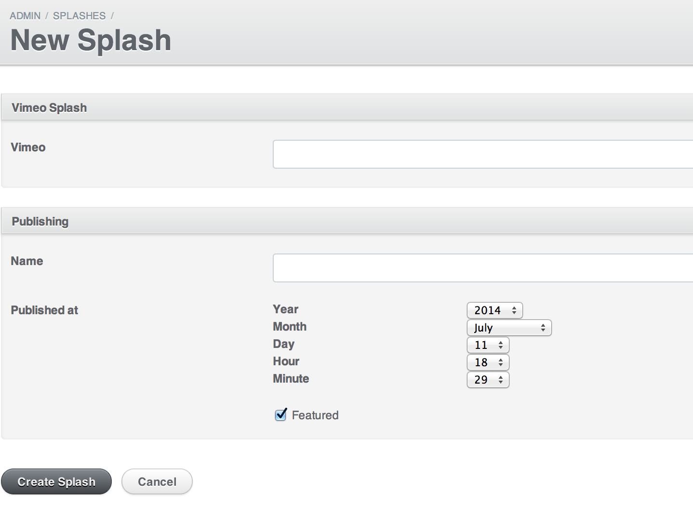

# Caste Quality Server

## Administration

First, navigate to `/admin` and login. If you're just testing stuff out and you're unsure about what its going to look like, go to `test.castequality.com` and follow the steps. Otherwise, changes made to `castequality.com` will be live.

### Adding a Post

Navigate to `/admin/posts`. Scroll to the right and click the `New Post` button.

Add a title and Body

When entering the body, style the paragraphs however you want with newlines.

To embed an image, click the `image` icon in the toolbar. You will be prompted to choose a photo

Pick a pre-existing image or upload a new one. To delete images, click the red `x` to the bottom right. Be sure you want to delete the photo, as it will be removed from the system.

Next, to embed a `YouTube` video, click the `YouTube` icon and paste in the embed code

Make sure that text is separated from the photos and videos by newlines.

### Adding a Splash

Navigate to `/admin/splashes`. Scroll to the right and click the `New Splash` button.

Insert the ID from the `vimeo` URL.

For instance, from `http://vimeo.com/99653555`, the ID is `99653555`

If you're posting another type of video, enter it into the `Video url` input. If
not, just let the vimeo ID do the work.

Next, enter the name of the splash.

If you'd like to schedule the splash to be published in the future, set the date
for the `published at` drop downs.

Finally, if you **DON'T** want the splash to be featured, uncheck the `featured` box,
otherwise, it will be the homepage splash once published.
